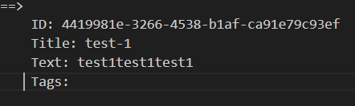
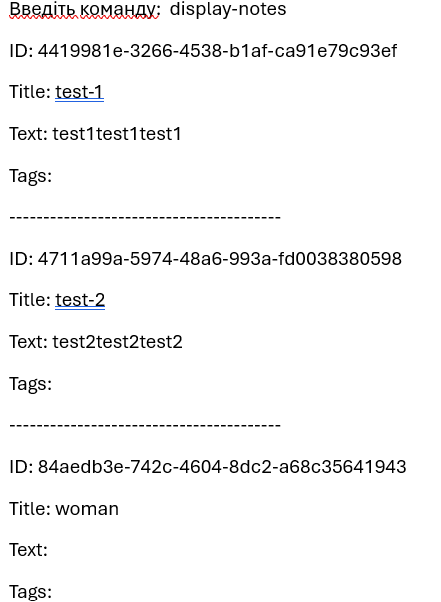

# CAPythonsBook

    
    
 

* ПЕРСОНАЛЬНИЙ ПОМІЧНИК надає можливість також: виводити список контактів, у яких день народження через задану кількість днів від поточної дати; перевіряти правильність введеного номера телефону та email під час створення або редагування запису.
Зберігати, проводити, пошук, редагувати та видаляти нотатки.

## [https://test.pypi.org/project/CAPythonsBook/0.0.2/#description](https://test.pypi.org/project/CAPythonsBook/0.0.2/#description)
## [https://github.com/DR24DR24/project-CAPythons.git](https://github.com/DR24DR24/project-CAPythons.git).

## `КОМАНДИ`
## 1. Виклик `[HELP]`:
Команда         `[Параметри]`                           Опис

* help            `[ _ ]`                               Виводить  повідомлення про доступні команди.
* *[приклад]*  ` help` ==> `"Список команд"`
## 2. Зберігання та управління контактами:
 

* hello            `[ _ ]`                          Виводить вітання.
* *[приклад]*  `Hello` ==> "How can i help you" 
* 
* add       `[ім'я] [телефон]`               Додає новий контакт у адресну книгу.
* *[приклад]*  `[add] ["John 7777777777"]` ==> "Контакт "John" додано з номером телефону "7777777777"
* 
* change         `[ім'я] [новий телефон]`                Змінює номер телефону існуючого контакту.
* *[приклад]*  `[change] ["John 5555555555"]` ==> "Телефон для контакту "John" змінено на 5555555555"
* 
* add-phone      `[ім'я] [телефон]`             Додає новий номер телефону до наявного контакту.
* *[приклад]*  `[add-phone] ["John 3333333333"]` ==> "Телефон 3333333333 додано до контакту "John""
* 
* add-birthday   `[ім'я] [дата народження]`        Додає день народження до наявного контакту.
* *[приклад]*  `[ add-birthday] ["John 31.05.1980"]` ==> "Дату народження для John встановлено на 31.05.1980'
* 
* all              `[ _ ]`                             Виводить всі контакти.
* *[приклад]*  `[ all]` ==> "Name John phone "5555555555" birthday "31.05.1980"
*  
* search-contact  `[пошуковий запит]`              Шукає контакти за заданими критеріями.
* *[приклад]*  `[search-contact]["John"]` ==> "Contact name: John; phone: 7777777777; Address: Germany'
* 
* show-phone     `[ім'я]`                         Показує номер телефону контакту.
* *[приклад]*  `[ show-phone] ["John"]` ==> "Contact name: John; phone: 7777777777;"
* 
## 3. Зберігання та управління НОТАТКАМИ:

* add-note        `[заголовок] [текст] [#теги]`      Додає нову нотатку.
* *[приклад]*  `[add-note] [man]` ==> "Додано нотатку з заголовком: man"
* edit-note       `[ID] [текст] [#теги]`      Редагує наявну нотатку.
* *[приклад]*  `[edit-note ] ["edit-note 84aedb3e-742c-4604-8dc2-a68c35641943 woman"]` ==> "'new_title'"
* delete-note     `[ID]`                     Видаляє наявну нотатку.
* *[приклад]*  `[delete-note] ["woman"]` ==> "Нотатку з заголовком "woman" видалено.""
* search-notes    `[пошуковий запит/заголовок/текст/#теги]` Шукає нотатки за заданими критеріями.
* *[приклад]*  `[search-notes] ["test1"]` ==> 

* display-notes   `[ _ ]`                               Виводить всі нотатки.
* *[приклад]*  `[display-notes] ["John"]` ==> 

## 4. Зберігання даних та вихід з програми:
* close           `[ _ ]`    Зберігає адресну книгу та виходить з програми.
* *[приклад]*  `[close]` ==> "До побачення!"
* exit            `[ _ ]`    Зберігає адресну книгу та виходить з програми.
* *[приклад]*  `[exit]` ==> "До побачення!"

## 5. Вибір мови:
* set-language    `['en' або 'uk']`  Встановлює мову застосунку
* *[приклад]*  `[set-language] [uk]` ==> "Мову встановлено на українська"
* *[приклад]*  `[set-language] [en]` ==> "Мову встановлено на англійська"

## Контактна інформація `CAPythons@super.BOT`
    
